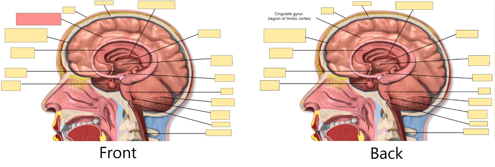
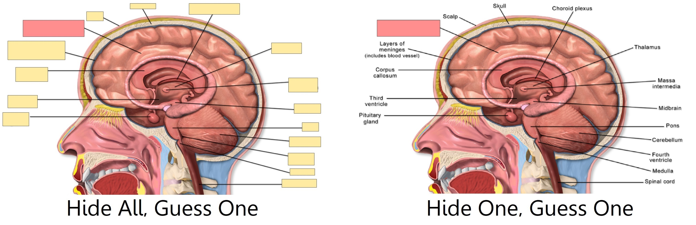

# Додавання та редагування

<!-- toc -->

## Додавання карток та нотаток

Як було сказано у розділі [Початок роботи](getting-started.md), ми
додаємо нотатки, а Anki на їх основі створює картки. Для появи вікна «Додати
нотатки», клацніть на кнопку «Додати» у [головному вікні](studying.md#Колоди).


У лівому верхньому кутку вікна показується поточний
[тип нотатки](getting-started.md#Типи-нотаток). Якщо там не написано «Базовий»,
значить Ви додали інші типи нотаток коли завантажували спільну колоду. Подальші
пояснення базуватимуться на припущенні, що обрано «Базовий» тип нотатки.

У правому верхньому кутку вікна вказано ім'я
[колоди](getting-started.md#Колоди) до якої додаватимуться картки. Щоб додавати
картки до нової колоди, клацніть на ім'я колоди, а тоді, у новому вікні - на
кнопку «Додати».

Внизу під типом нотатки є декілька кнопок та область з позначками
«Передня сторона» та «Зворотна сторона». Передня та зворотна сторони
називаються [полями](getting-started.md#Нотатки-та-поля), і Ви можете додати
нові, видалити чи перейменувати наявні поля, клацнувши зверху на кнопці "Поля…".

Під полями існує ще одна область, позначена як **мітки**. Мітки є позначками,
які Ви можете прикріпляти до нотаток, щоб полегшити їх організацію та пошук. Ця
область може бути порожньою, або ви можете додати необхідні мітки. Мітки
відокремлюються одна від одної за допомогою пробілів. Якщо в області міток
вказано

    словник перевірити_з_вчителем

… тоді створена Вами нотатка матиме дві мітки.

Ввівши текст для передньої і зворотної сторін, Ви можете додати нотатку до
колекції, клацнувши на кнопку «Додати» або натиснути
<kbd>Ctrl</kbd>+<kbd>Enter</kbd> (чи <kbd>Command</kbd>+<kbd>Enter</kbd> на
Маці). Як наслідок, нова картка створиться та покладеться до обраної Вами
колоди. Щоб відредагувати щойно створену картку, натисніть на кнопку "Історія"
та знайдіть цю картку у [навігаторі](browsing.md).

Більше інформації щодо кнопок які стосуються типу нотатки та полів подано
у параграфі [Можливості редагування](editing.md#Можливості-редагування)

### Перевірка дублікатів

Anki перевіряє перше поле на унікальність, а тому попередить, якщо Ви введете
дві картки з передньою стороною, наприклад, "яблуко". Перевірка на унікальність
обмежується поточним типом нотатки, тому, коли Ви вивчатимете декілька мов,
дві картки з однаковою передньою стороною не будуть вважатися дублікатами
допоки вони належать різним типам нотатки у кожній з мов.

Anki, з міркувань ефективності, не здійснює автоматичної перевірки інших полів
на наявність дублікатів. Однак Навігатор має інструмент "Пошук дублікатів",
яким Ви можете користуватися час від часу.

### Успішне навчання

Люди організовують процес пригадування по-різному, однак деякі загальні
концепції варто знати. Їх чудово подано у
[цій статті](https://super-memory.com/articles/20rules.htm)
на сторінці SuperMemo. Зверніть увагу на такі поради як:

- **Зберігайте простоту**: Коротші картки пригадуються легше. Ви можете
  спокуситися додаванням інформації "про всяк випадок", однак такі пригадування
  швидко стануть нестерпними.

- **Не запам'ятовуйте без розуміння**: Якщо Ви вчите мову, намагайтеся уникати
  великих списків слів. Мова найкраще вчиться в контексті, де Ви бачите як
  слова використовуються в реченнях. Або, уявіть, що Ви вчитесь на комп'ютерних
  курсах. Якщо Ви спробуєте запам'ятати купу абревіатур, Ваш прогрес навряд чи
  буде швидким. Однак, якщо Ви присвятите час розумінню концепцій, які
  ховаються за абревіатурами, вивчення останніх відбуватиметься значно легше.

## Додавання типу нотатки

Хоча основних типів нотаток достатньо для створення простих карток з одним
словом чи фразою на кожній зі сторін, проте, щойно Ви захочете додати більше
інформації, краще розміщувати її в окремих полях.

У Вас може закрастися думка "якщо мені потрібна лише одна картка, то чому я не
можу додати у поле передньої сторони аудіо, малюнок, підказку та переклад?"
І Ви, звісно, можете це зробити. Однак, недоліком стане те, що вся інформація
буде перемішана в одному місці. Пізніше, Ви не зможете відсортувати картку,
скажімо, за підказкою, адже вона буде поміж іншого матеріалу. Також, Ви не
зможете робити такі речі як перенесення аудіо з передньої сторони на зворотну
іншим чином, окрім як копіюючи та вставляючи його на кожній картці. Зберігаючи
різний тип матеріалу у окремих полях, можна значно легше налаштовувати вигляд
карток.

Створити новий тип нотатки можна, обравши у головному вікні Anki пункт меню
"Інструменти" → "Керувати типами нотаток". Додавання типу нотатки відбувається
за допомогою клацання на кнопку «Додати». Опісля, у новому вікні слід обрати
тип нотатки, на якому базуватиметься новостворений. Слово «Додати», перед
типом нотатки, вказує, що новий тип буде створено на основі того типу нотатки,
який постачається разом з Anki. «Дублювати» - вказує на тип нотатки, який
зберігається у Вашій колекції. Так, якщо у Вас вже є тип нотатки для словника
французької мови, то Ви можете дублювати його та створити тип нотатки для
словника німецької.

Після натискання на «ОК», Вам буде запропоновано ввести ім'я нового типу.
Хорошим прикладом буде вказати назву навчального матеріалу, як от «Японська»,
«Дрібниці» тощо. Вказавши ім'я, закрийте вікно "Типи нотаток" та поверніться
на початкове вікно.

## Налаштування полів

Налаштування полів відбувається після натискання на кнопку "Поля…", яка
доступна при додаванні чи редагуванні нотатки, або коли нотатку виділено у
вікні "Керувати типами нотаток".


Додавання, видалення та перейменування полів відбувається за допомогою
відповідних кнопок. Зміна порядку показу полів у цьому діалоговому вікні та у
вікні "Додати нотатку" можлива за допомогою кнопки "Змінити розташування",
після натискання на яку, слід вказати порядковий номер поля. Якщо Ви
хочете зробити певне поле першим, введіть для нього число "1".

Не називайте поля 'Tags', 'Type', 'Deck', 'Card', or 'FrontSide', оскільки ці
назви є [спеціальними полями](templates/fields.md#Спеціальні-поля) і вони не
працюватимуть правильно.

Налаштування внизу екрану дозволяють змінювати властивості полів, які
використовуються при додаванні або редагуванні карток. Вони _не_ впливають на
те, як картки показуються при пригадуванні; більше інформації подано у розділі
[Шаблони карток](templates/intro.md).

- **Редакторський шрифт** - дозволяє налаштувати шрифт та його розмір для
  редагування нотаток. Цей параметр дозволяє зменшити вигляд неважливої
  інформації чи збільшити величину тих іноземних символів, які складно читати.
  Цей параметр не впливає на вигляд карток під час пригадування: для внесення
  таких змін перегляньте розділ [Шаблони карток](templates/intro.md).
  Однак, якщо Ви увімкнули функцію "Вдрукувати відповідь", то розмір шрифту
  вдрукованого тексту буде таким, як вказано у цьому параметрі. (Щоб дізнатися
  як змінити вигляд шрифту при вдруковуванні відповіді, зверніться до розділу
  [Перевірка відповіді](templates/fields.md#Перевірка-відповіді).)

- **Сортувати по цьому полю у навігаторі** додає це поле у стовпчик
  "Поле сортування" навігатора. Використовуйте цей параметр щоб сортувати
  картки за значенням обраного поля. Полем сортування може бути лише одне поле
  картки.

- **Зворотній напрямок тексту (RTL)** є корисним при вивченні мов у яких текст
  записується справа наліво, як от арабська чи іврит. Наразі даний параметр
  застосовується лише при редагуванні; щоб текст показувався правильно під час
  пригадування, слід налаштувати
  [шаблони](templates/styling.md#Напрям-тексту).

- **Типово використовувати редактор HTML** слід увімкнути, якщо Ви надаєте
  перевагу редагуванню полів одразу у HTML.

- **Типово згортати**. Поля можуть бути згорнутими/розгорнутими.
  Відповідну анімацію можна відключити у [налаштуваннях](preferences.md).

- **Виключити з некваліфікованого пошуку (повільніше)** можна використовувати
  якщо Ви не хочете, щоб вміст поля з'являвся у результатах некваліфікованого
  [(не обмеженого вказаним полем)](searching.md#В-межах-поля) пошуку.

Після додавання полів, Ви, ймовірно, захочете показати їх на передній чи
зворотній сторонах карток. Як це зробити описано у розділі
[Шаблони карток](templates/intro.md).

## Зміна колоди або типу нотатки

Під час додавання, Ви можете клацнути на верхню ліву кнопку "Тип", щоб змінити
тип нотатки та верхню праву кнопку "Колода", щоб змінити колоду. У вікні, яке
відкриється після клацання, можна не лише обрати потрібну колоду чи тип
нотатки, а й додати нові колоди чи керувати типами нотаток.

## Впорядкування матеріалів

### Правильне використання колод

[Колоди](getting-started.md#Колоди) спроєктовано для об'єднання матеріалів у
об'ємні категорії, які слід вивчати нарізно, як от англійська мова, географія
тощо. Ви можете спокуситися на створення багатьох маленьких колод, як от
«Моя книжка з географії, розділ 1» чи «Дієслова, що стосуються їжі», щоб
тримати свою інформацію впорядкованою, однак ми не радимо це роботи адже:

- За наявності багатьох маленьких колод Ви будете бачити картки в
  упізнаваному порядку. У старіших версіях планувальника нові картки з'являлися
  за порядком колод. І якщо Ви планували клацати на кожну колоду по черзі (що
  є досить повільним), все закінчилося б тим, що усі пригадування з «розділу 1»
  та «Дієслів, що стосуються їжі» опинилися б поруч. В такому випадку на картки
  легше відповідати, оскільки їх можна вгадувати за контекстом, проте це
  призведе до поганого запам'ятовування. Коли треба буде пригадати слово чи
  фразу поза Anki, у Вас не завжди буде перевага у вигляді попереднього показу
  пов'язаної інформації.

- Хоч ця проблема є меншою порівняно з тим, якою вона була у попередніх версіях
  Anki, додавання сотень колод може стати причиною уповільнення роботи, а дуже
  великі дерева з колод, з тисячами елементів можуть справді зіпсувати показ
  перелік колод у версіях Anki до 2.1.50.

### Використання міток

Для класифікації інформації краще створювати мітки, аніж багато маленьких
колод. Мітки допомагають покращити результати пошуку, знайти специфічну
інформацію та підтримують порядок у колекції. Ефективно використовувати мітки
та прапорці можна по-різному, а попереднє продумування їх подальшого
використання дозволить вирішити якнайкраще застосування саме для Вас.

Хтось організовує картки у колоди та підколоди, однак використання міток має
велику перевагу: до нотатки можна додати декілька міток, однак нотатку можна
додати лише до однієї колоди. Таким чином, у більшості випадків, мітки є
потужнішою і гнучкішою системою категоризації порівняно з колодами. Мітки можна
організовувати у дерева
[за тим же принципом, що й колоди](getting-started.md#Колоди).

Наприклад, замість того, щоб створювати колоду «Дієслова, що стосуються їжі»,
картки можна додати до основної колоди, присвяченої вивченню мови, з мітками
«їжа» та «дієслово». Оскільки кожна картка може мати декілька міток, Ви можете
[знайти](searching.md#Мітки-колоди-картки-та-нотатки) всі дієслова, всі слова
пов'язані з їжею або ж всі дієслова, які стосуються їжі.

Мітки можна додавати у вікні "Редагування картки" або
[Навігаторі](browsing.md), у якому можна додавати, видаляти, перейменовувати чи
впорядковувати мітки. Завважте, що мітки працюють на рівні
[нотатки](getting-started.md#Нотатки-та-поля), тобто встановлення мітки для
картки, яка має сестринські картки, встановить цю мітку і для сестринських
карток. Щоб встановити мітку лише для однієї картки, а не її сестринських
карток, скористайтеся прапорцями.

### Використання прапорців

Прапорці схожі на мітки, але вони з'являються у правому верхньому кутку вікна
пригадування, під час навчання. Їх можна використовувати для пошуку карток у
вікні Навігатора, перейменовувати у Навігаторі чи створювати, з позначених
ними карток, фільтровані колоди. Однак, на противагу міткам, для картки можна
встановити одночасно лише один прапорець. Іншою важливою особливістю прапорців
є те, що вони працюють на рівні [картки](getting-started.md#Картки), а тому
встановлення прапорця для картки, не впливає на сестринські картки.

Встановлювати та знімати прапорці можна у режимі пригадування (натиснувши
<kbd>CTRL</kbd> + <kbd>1-7</kbd> у Windows та Linux або
<kbd>CMD</kbd> + <kbd>1-7</kbd> у Маці) та у [Навігаторі](browsing.md).

### Мітка "marked"

Anki поводиться з міткою "marked" по-особливому. Додати або забрати її
можна за допомогою параметрів у вікні пригадування та у навігаторі.
Якщо нотатка поточної картки має цю мітку, то у вікні пригадування з'явиться
зірочка. Картки для нотатки з цією позначкою матимуть інший колір у
Навігаторі.

Зверніть увагу: Позначення з міткою "marked" залишено для сумісності зі
старішими версіями Anki; більшості користувачам краще використовувати
[прапорці](editing.md#Використання-прапорців).


### Using Fields

For those who like to stay very organized, you can add fields to your
notes to classify your content, such as "book", "page", and so on. Anki
supports searching in specific fields, which means you can do a search
for `"book:my book" page:63` and immediately find what you're looking
for.

### Custom Study and Filtered Decks

Using [custom study and filtered deck](filtered-decks.md) you can create
temporary decks out of search
terms. This allows you to review your content mixed together in a single
deck most of the time (for optimum memory), but also create temporary
decks when you need to focus on particular material, such as before a
test. The general rule is that if you always want to be able to study
some content separately, it should be in a normal deck; if you only
occasionally need to be able to study it separately (for a test, when
under a backlog, etc.), then filtered decks created from tags, flags,
marks or fields are better.

## Можливості редагування

The editor is shown when [adding notes](editing.md), [editing a note](studying.md#Редагувати-та-Більше) during reviews, or [browsing](browsing.md).


On the top left are two buttons, which open the [fields](editing.md#Налаштування-полів) and
[cards](templates/intro.md) windows.

On the right are buttons that control formatting. Bold, italic and
underline work like they do in a word processing program. The next two
buttons allow you to subscript or superscript text, which is useful for
chemical compounds like H<sub>2</sub>O or simple mathematical equations like
x<sup>2</sup>. Then, there are two buttons to allow you to change text colour.

The rubber eraser button clears any formatting in the currently selected text — including the colour
of the text, whether the selected text is bold, etc. The next three buttons allow creating lists, text alignment and text indent.

You can use the paper-clip button to select audio, images, and videos from
your computer's hard drive and attach them to your notes. Alternatively, you
can copy the media onto your computer's clipboard (for instance, by
right-clicking an image on the web and choosing 'Copy Image') and paste
it into the field that you want to place it in. For more information
about media, please see the [media](media.md) section.

The microphone icon allows you to record from your computer's microphone
and attach the recording to the note.

The Fx button shows shortcuts to add MathJax or
[LaTeX](math.md) to your notes.

The \[…​\] buttons are visible when a cloze note type is selected.


The `</>` button allows editing the underlying HTML of a field.


Anki 2.1.45+ supports adjusting sticky fields directly from the editing screen.
If you click on the pin icon on the right of a field, Anki will not clear out
the field's content after a note is added. If you find yourself entering the
same content into multiple notes, you may find this useful. On previous Anki
versions, sticky fields were toggled from the Fields screen.


Most of the buttons have shortcut keys. You can hover the mouse cursor
over a button to see its shortcut.

When pasting text, Anki will keep most formatting by default. If you
hold down the <kbd>Shift</kbd> key while pasting, Anki will strip most of the
formatting. Under Preferences, you can toggle "Paste without shift
key strips formatting" to modify the default behaviour.

## Закривання тексту

'Cloze deletion' is the process of hiding one or more words in a
sentence. For example, if you have the sentence:

    Canberra was founded in 1913.

…​and you create a cloze deletion on "1913", then the sentence would
become:

    Canberra was founded in [...].

Sometimes sections that have been removed in this fashion are said to be
'occluded'.

For more information on why you might want to use cloze deletion, see
Rule 5 [here](https://super-memory.com/articles/20rules.htm).

Anki provides a special cloze deletion type of note, to make creating
clozes easy. To create a cloze deletion note, select the Cloze note
type, and type some text into the "Text" field. Then drag the mouse over
the text you want to hide to select it, and click the \[…​\] button.
Anki will replace the text with:

    Canberra was founded in {{c1::1913}}.

The "c1" part means that you have created one cloze deletion on the
sentence. You can create more than one deletion if you'd like. For
example, if you select Canberra and click \[…​\] again, the text will
now look like:

    {{c2::Canberra}} was founded in {{c1::1913}}.

When you add the above note, Anki will create two cards. The first card
will show:

    Canberra was founded in [...].

…​on the question, with the full sentence on the answer. The other card
will have the following on the question:

    [...] was founded in 1913.

You can also elide multiple sections on the same card. In the above
example, if you change c2 to c1, only one card would be created, with
both Canberra and 1913 hidden. If you hold down <kbd>Alt</kbd> (<kbd>Option</kbd> on a Mac)
while creating a cloze, Anki will automatically use the same number
instead of incrementing it.

Cloze deletions don't need to fall on word boundaries, so if you select
"anberra" rather than "Canberra" in the above example, the question
would appear as "C\[…​\] was founded in 1913", giving you a hint.

You can also give yourself hints that don't match the text. If you
replace the original sentence with:

    Canberra::city was founded in 1913

…​and then press \[…​\] after selecting "Canberra::city", Anki will
treat the text after the two colons as a hint, changing the text into:

    {{c1::Canberra::city}} was founded in 1913

When the card comes up for review, it will appear as:

    [city] was founded in 1913.

For information on testing your ability to type in a cloze deletion
correctly, please see the section on [typing answers](templates/fields.md#Перевірка-відповіді).

From version 2.1.56, nested cloze deletions are supported. For example, the following is valid:

    {{c1::Canberra was {{c2::founded}}}} in 1913

The inner cloze is entirely nested within the outer. There is no support for partial overlaps, such as:

    [...] founded in 1913 -> Canberra was
    Canberra [...] in 1913 -> was founded

with the word "was" appearing in both deletions.

Prior to version 2.1.56, if you need to create clozes from overlapping text, add another Text
field to your cloze, add it to the [template](templates/intro.md), and then when
creating notes, paste the text into two separate fields, like so:

    Text1 field: {{c1::Canberra was founded}} in 1913

    Text2 field: {{c2::Canberra}} was founded in 1913

The default cloze note type has a second field called Extra, that is
shown on the answer side of each card. It can be used for adding some
usage notes or extra information.

The cloze note type is treated specially by Anki, and cannot be created
based on a regular note type. If you wish to customize it, please make
sure to clone the existing Cloze type instead of another type of note.
Things like formatting can be customized, but it is not possible to add
extra card templates to the cloze note type.

## Закривання зображень

Anki 23.10+ supports Image Occlusion cards natively. An Image
Occlusion (IO) note is a special case of cloze deletion based on images
instead of text, and allows you to create cards that hide some parts
of an image, testing your knowledge of that hidden information.



### Adding an image

To add IO cards to your collection, open the Add screen, click on "Type"
and choose "Image Occlusion" from the list of built-in note types.
Then, click on "Select Image" to load an image file saved on your
computer's hard drive, or on "Paste image from clipboard"
if you have an image copied to the clipboard.

### Adding IO cards

After loading an image, the IO editor will open. Click on the
icons on the left to add as many areas to your image as you want.
There are three basic shapes to choose from:

- Rectangle
- Ellipse
- Polygon

You can also choose between two different IO modes for each note:

- **Hide All, Guess One**: All areas are hidden and only one
  area at a time is revealed while learning.
- **Hide One, Guess One**: Only one area at a time is hidden
  and will be revealed during learning. The other areas will be visible.



Once you're done, click on the "Add" button, at the bottom of the screen.
Anki will add a card for each shape or group of shapes you added in the previous step,
and you can start reviewing them normally.

## Editing IO notes

You can edit your IO notes by clicking on "Edit" while reviewing,
or directly from the browser. There are several tools that you
can use. Of note:

- Select: It allows you selecting one or more shapes to move,
  resize, delete or group them.
- Zoom: You can freely move the image and zoom in or out using the mouse wheel.
- Shapes (Rectangle, Ellipse or Polygon): Use them to add new shapes / cards.
- Text: It adds text areas to your image. These text areas can be moved,
  resized or deleted, but no card will be created when you use this tool.
- Undo / Redo.
- Zoom In / Out - Reset zoom.
- Toggle Translucency: Use this tool to temporarily view the hidden areas.
- Delete: Use this tool to delete selected shapes and text areas. Please
  note that deleting a shape won't delete its associated card automatically;
  you will need to use Tools>Empty Cards afterwards, the same as
  with regular cloze deletions.
- Duplicate.
- Group selection: Use this tool to create a cluster of shapes, which will
  allow you to move, resize or delete them simultaneously. Please note that
  two or more single shapes will create only one card once grouped.
- Ungroup selection: Select a group and then click this button to make each shape independent again.
- Alignment: This tool can be used to align your shapes / text areas as desired.

While reviewing IO Cards a "Toggle Masks" button will appear just below the image.
This button will temporary clear all shapes of the note when using "Hide All, Guess One" mode.

## Inputting Foreign Characters and Accents

All modern computers have built-in support for typing accents and
foreign characters, and multiple ways to go about it. The method we
recommend is by using a keyboard layout for the language you want to learn.

Languages with a separate script like Japanese, Chinese, Thai, and so on,
have their own layouts specific to that language.

European languages that use accents may have their own layout, but can
often be typed on a generic "international keyboard" layout. These work
by typing the accent, then the character you want accented - e.g. an
apostrophe (') then the letter a (a) gives á.

To add the international keyboard on Windows machines, please see
<https://thegeekpage.com/how-to-add-us-international-keyboard-in-windows-10/>

To add it on Macs, please see
<http://www.macworld.com/article/1147039/os-x/accentinput.html>

Keyboards for a specific language are added in a similar way, but we can
not cover them all here. For more information, please try searching
Google for "input Japanese on a mac", "type Chinese on Windows 10", and
so on.

If you are learning a right-to-left language, there are lots of other
things to consider. Please see [this page](http://dotancohen.com/howto/rtl_right_to_left.html) for more
information.

The toolkit on which Anki is built has trouble dealing with a few input
methods, such as holding down keys to select accented characters on macOS,
and typing characters by holding down the <kbd>Alt</kbd> key and typing a
numeric code on Windows.

## Unicode Normalization

Text like `á` can be represented in multiple ways on a computer, such as
using a specific code for that symbol, or by using a standard `a` and then
another code for the accent on top. This causes problems when mixing input
from different sources, or using different computers - if your computer
handles keyboard input in one form, but the content is stored in a different
form, it will not match when searching, even though the end result appears
identical.

To ensure content can easily be found in searches, Anki normalizes the text
to a standard form. For most users this process is transparent, but if you
are studying certain material like archaic Japanese symbols, the normalization
process can end up converting them to a more modern equivalent.

If you want character variants preserved, the following in the [debug console](./misc.md)
will turn off normalization:

```python
mw.col.conf["normalize_note_text"] = False
```

Any content added after that will remain untouched. The trade-off is that you may
find it difficult to search for the content if you're switching between operating
systems, or pasting content from mixed sources.
